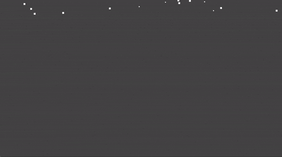

# Godot 3 2D Fake Snow Particles

  

A script to simulate snow particles ❄️.



## Table of contents

### Variables

|Name|Type|Default|
|:-|:-|:-|
|[emitting](#emitting)|`bool`|`false`|
|[amount](#amount)|`int`|`200`|
|[visibility_rect](#visibility_rect)|`Rect2`|`Rect2(0.0, -100.0, 320.0, 180.0)`|
|[colors](#colors)|`PoolColorArray`|`[Color(1.0, 1.0, 1.0, 1.0)]`|
|[min_velocity](#min_velocity)|`float`|`10.0`|
|[max_velocity](#max_velocity)|`float`|`50.0`|
|[timer_wait_time](#timer_wait_time)|`float`|`5.0`|
|[preprocess](#preprocess)|`bool`|`false`|

## Variables

### emitting

```gdscript
export (bool) var emitting = false setget _set_emitting
```

If `true`, particles are being emitted.

|Name|Type|Default|Setter|
|:-|:-|:-|:-|
|`emitting`|`bool`|`false`|`_set_emitting`|

### amount

```gdscript
export (int) var amount = 200 setget _set_amount
```

The number of particles.

|Name|Type|Default|Setter|
|:-|:-|:-|:-|
|`amount`|`int`|`200`|`_set_amount`|

### visibility_rect

```gdscript
export (Rect2) var visibility_rect = Rect2(0.0, -100.0, 320.0, 180.0) setget _set_visibility_rect
```

Controls the visibility of the particles.

|Name|Type|Default|Setter|
|:-|:-|:-|:-|
|`visibility_rect`|`Rect2`|`Rect2(0.0, -100.0, 320.0, 180.0)`|`_set_visibility_rect`|

### colors

```gdscript
export (PoolColorArray) var colors = [Color(1.0, 1.0, 1.0, 1.0)] setget _set_colors
```

The color/s of the particles.

 If there is more than 1 color, these colors will be applied randomly \ on the "background" particles along with the main color.

|Name|Type|Default|Setter|
|:-|:-|:-|:-|
|`colors`|`PoolColorArray`|`[Color(1.0, 1.0, 1.0, 1.0)]`|`_set_colors`|

### min_velocity

```gdscript
export (float) var min_velocity = 10.0 setget _set_min_velocity
```

The possible minimum velocity of the particles.

|Name|Type|Default|Setter|
|:-|:-|:-|:-|
|`min_velocity`|`float`|`10.0`|`_set_min_velocity`|

### max_velocity

```gdscript
export (float) var max_velocity = 50.0 setget _set_max_velocity
```

The possible maximum velocity of the particles.

|Name|Type|Default|Setter|
|:-|:-|:-|:-|
|`max_velocity`|`float`|`50.0`|`_set_max_velocity`|

### timer_wait_time

```gdscript
export (float) var timer_wait_time = 5.0 setget _set_timer_wait_time
```

The amount of time (in seconds) until the next cycle of particles is emitted.

|Name|Type|Default|Setter|
|:-|:-|:-|:-|
|`timer_wait_time`|`float`|`5.0`|`_set_timer_wait_time`|

### preprocess

```gdscript
export (bool) var preprocess = false
```

If `true`, [visibility_rect](#visibility_rect) will be full of particles when loading the scene.

|Name|Type|Default|
|:-|:-|:-|
|`preprocess`|`bool`|`false`|

## 🗒️ Changelog

See [CHANGELOG](/CHANGELOG.md).

## 👤 Author

- hiulit

## 🤝 Contributing

Feel free to:

- [Open an issue](https://github.com/hiulit/Godot-3-2D-Fake-Snow-Particles/issues) if you find a bug.
- [Create a pull request](https://github.com/hiulit/Godot-3-2D-Fake-Snow-Particles/pulls) if you have a new cool feature to add to the project.

## 🙌 Supporting this project

If you find this project helpful, please consider supporting it through any size donations to help make it better.

[](https://www.patreon.com/hiulit)

[](https://ko-fi.com/F2F7136ND)

[](https://www.buymeacoffee.com/hiulit)

[](https://www.paypal.com/paypalme/hiulit)

If you can't, consider sharing it with the world...

[](https://twitter.com/intent/tweet?url=https://github.com/hiulit/Godot-3-2D-Fake-Snow-Particles&text=%22Godot%203%202D%20Fake%20Snow%20Particles%22%0AA%20script%20to%20simulate%20snow%20particles%20%E2%9D%84%EF%B8%8F.%0A%0ABy%20@hiulit%0A%0A)

... or giving it a [star](https://github.com/hiulit/Godot-3-2D-Fake-Snow-Particles/stargazers).

Thank you very much!

## 📝 Licenses

- Source code: [MIT License](/LICENSE).
- Documentation ([GDScriptify](https://github.com/hiulit/GDScriptify)): [MIT License](/LICENSE_GDSCRIPTIFY.txt).

---

Powered by [GDScriptify](https://github.com/hiulit/GDScriptify).
